<div align="center">


<br><br>

<a href="https://git.io/typing-svg">
  
</a>

<br><br>

[]()
[]()
[]()
[]()

<br><br>

[](https://t.me/voyger_xyz)
[](https://t.me/voyger_xyz)
[]()

</div>

<br>

---

<div align="center">

## ☠️ **W3D STORE** ☠️

</div>

<div align="center">

```
╔═══════════════════════════════════════════════════════════════════════════╗
║                                                                           ║
║    ██╗    ██╗██████╗ ██████╗      ███████╗████████╗ ██████╗ ██████╗ ███████╗
║    ██║    ██║╚════██╗██╔══██╗     ██╔════╝╚══██╔══╝██╔═══██╗██╔══██╗██╔════╝
║    ██║ █╗ ██║ █████╔╝██║  ██║     ███████╗   ██║   ██║   ██║██████╔╝█████╗  
║    ██║███╗██║ ╚═══██╗██║  ██║     ╚════██║   ██║   ██║   ██║██╔══██╗██╔══╝  
║    ╚███╔███╔╝██████╔╝██████╔╝     ███████║   ██║   ╚██████╔╝██║  ██║███████╗
║     ╚══╝╚══╝ ╚═════╝ ╚═════╝      ╚══════╝   ╚═╝    ╚═════╝ ╚═╝  ╚═╝╚══════╝
║                                                                           ║
║                     💀  DOWNLOAD  THE  FUTURE  💀                         ║
║                                                                           ║
╚═══════════════════════════════════════════════════════════════════════════╝
```

</div>

<br>

---

<div align="center">

## ⚠️ **RESTRICTED AREA — ENTER AT YOUR OWN RISK** ⚠️

</div>

<br>

<table align="center">
<tr>
<td>

```
████████████████████████████████████████████████████████████████
█                                                              █
█   ⚠️  THIS IS A RESTRICTED AREA                               █
█                                                              █
█   ⚠️  UNAUTHORIZED ACCESS WILL BE TRACED                      █
█                                                              █
█   ⚠️  ALL ACTIVITIES ARE MONITORED                            █
█                                                              █
█   ⚠️  DOWNLOAD AT YOUR OWN RISK                               █
█                                                              █
█   ⚠️  NO RULES. NO MERCY. NO MERCY.                          █
█                                                              █
████████████████████████████████████████████████████████████████
```

</td>
</tr>
</table>

<br>

---

<div align="center">

## 🔥 **WHAT IS W3D STORE?** 🔥

</div>

> ### 💀 **W3D STORE** is not your average app store.
>
> It's a **ghost in the machine** — a fully-functional, dark-web-inspired Android marketplace that runs **entirely on the frontend**.
>
> ```
> 🚫 No servers
> 🚫 No databases  
> 🚫 No backend
> 🚫 No masters
> 🚫 No rules
> ```
>
> Just one HTML file. And chaos.
>
> Built by hackers. For hackers. For anyone who's tired of Play Store's endless ads, invasive tracking, and regional bullshit.

<div align="center">

### 💀 **"Premium apps. Zero compromise. Zero mercy."** 💀

</div>

<br>

---

<div align="center">

## ⚡ **WEAPONS OF CHOICE** ⚡

</div>

<br>

<table align="center">
<tr>
<td width="50%" align="center" valign="top">

### 🎨 **VISUAL WARFARE**

```
━━━━━━━━━━━━━━━━━━━━━━━━━━━━━━━━━
☠️  Dark web cyberpunk theme
🌈  Rainbow animated text
✨  Floating glowing particles  
🖱️  Custom crosshair cursor
💀  Neon glow effects
🔥  Blood-red danger vibes
📱  Fully responsive design
🌊  Smooth 60 FPS animations
⚡  Real-time interactions
🎭  Holographic borders
━━━━━━━━━━━━━━━━━━━━━━━━━━━━━━━━━
```

</td>
<td width="50%" align="center" valign="top">

### 🚀 **COMBAT SYSTEMS**

```
━━━━━━━━━━━━━━━━━━━━━━━━━━━━━━━━━
📦  Unlimited apps (Cloud)
🔍  Real-time search
📊  Sort by date/downloads/name
📥  Direct APK download
🖼️  Custom icon URL support
🔐  Admin panel (protected)
✏️  Edit existing apps
🗑️  Delete apps
🏷️  Category system
📩  Telegram integration
━━━━━━━━━━━━━━━━━━━━━━━━━━━━━━━━━
```

</td>
</tr>
</table>

<br>

---

<div align="center">

## 🎬 **LIVE TERMINAL PREVIEW** 🎬

</div>

<br>

<table align="center">
<tr>
<td>

```
╔═══════════════════════════════════════════════════════════════════╗
║                                                                   ║
║  ☠️  W3D STORE             ● LIVE            📩 TELEGRAM          ║
║  ═══════════════════════════════════════════════════════════════   ║
║                                                                   ║
║  ⚠️  WARNING: RESTRICTED AREA — UNAUTHORIZED ACCESS TRACED       ║
║                                                                   ║
║                                                                   ║
║       ██╗    ██╗██████╗ ██████╗     ███████╗████████╗ ██████╗      ║
║       ██║    ██║╚════██╗██╔══██╗    ██╔════╝╚══██╔══╝██╔═══██╗     ║
║       ██║ █╗ ██║ █████╔╝██║  ██║    ███████╗   ██║   ██║   ██║     ║
║       ██║███╗██║ ╚═══██╗██║  ██║    ╚════██║   ██║   ██║   ██║     ║
║       ╚███╔███╔╝██████╔╝██████╔╝    ███████║   ██║   ╚██████╔╝     ║
║        ╚══╝╚══╝ ╚═════╝ ╚═════╝     ╚══════╝   ╚═╝    ╚═════╝      ║
║                                                                   ║
║                      T  H  E    F  U  T  U  R  E                  ║
║                                                                   ║
║                                                                   ║
║    ┌──────────────────────────────────────────────────┐           ║
║    │  >_ SEARCH APPS...              [ SEARCH → ]     │           ║
║    └──────────────────────────────────────────────────┘           ║
║                                                                   ║
║                                                                   ║
║    ☠️ TOTAL APPS (1)  │  📱 APPS  │  🛠️ TOOLS  │  🎮 GAMES      ║
║                                                                   ║
║                                                                   ║
║    ┌─────────────────────────────────────────┐                   ║
║    │  ┌────┐                                  │                   ║
║    │  │ 🛠️ │  TERMUX ULTIMATE                 │                   ║
║    │  └────┘  v2.14.5 · 🛠️ TOOLS             │                   ║
║    │                                          │                   ║
║    │  💬 Ultra powerful Android terminal...  │                   ║
║    │                                          │                   ║
║    │  📥 INSTALL →                            │                   ║
║    └─────────────────────────────────────────┘                   ║
║                                                                   ║
║                                                                   ║
║  ═══════════════════════════════════════════════════════════════  ║
║  💀 DEVILS WILL RISE · @VOYGER_XYZ                                ║
║                                                                   ║
╚═══════════════════════════════════════════════════════════════════╝
```

</td>
</tr>
</table>

<br>

---

<div align="center">

## 🚀 **DEPLOYMENT — 3 WAYS TO LAUNCH** 🚀

### ⚔️ **CHOOSE YOUR WEAPON**

</div>

<br>

### 🅰️ **LOCAL TESTING**

```bash
# 📥 Clone the repository
git clone https://github.com/YOUR_USERNAME/w3d-store.git
cd w3d-store

# 🚀 Serve locally
python -m http.server 8000

# ⚡ Or use Node.js
npx serve
```

**🌐 Open:** `http://localhost:8000`

<br>

### 🅱️ **VERCEL DEPLOY (RECOMMENDED)**

[](https://vercel.com/new/clone?repository-url=https://github.com/YOUR_USERNAME/w3d-store)

```bash
# 📋 Manual Steps:
1️⃣  Push repo to GitHub
2️⃣  vercel.com → New Project
3️⃣  Import repo → Deploy
4️⃣  URL: https://w3d-store.vercel.app
```

<br>

### 🅲 **GITHUB PAGES**

```bash
1️⃣  Repo → Settings → Pages
2️⃣  Source: main branch
3️⃣  Save
4️⃣  URL: https://YOUR_USERNAME.github.io/w3d-store/
```

<br>

---

<div align="center">

## 🔐 **ADMIN ACCESS** 🔐

</div>

<br>

<table align="center">
<tr>
<td>

```
╔═══════════════════════════════════════════════════╗
║                                                   ║
║        ⚠️  RESTRICTED ACCESS  ⚠️                   ║
║                                                   ║
║   🌐 URL:      /#admin                            ║
║   👤 Username: unknown_guy                        ║
║   🔑 Password: DevilsWillRise2026                 ║
║                                                   ║
║        ☠️  CHANGE DEFAULT PASSWORD  ☠️             ║
║                                                   ║
╚═══════════════════════════════════════════════════╝
```

</td>
</tr>
</table>

**🛠️ Change password in `index.html`:**

```javascript
const ADMIN_USER = "unknown_guy";
const ADMIN_PASS = "DevilsWillRise2026";  // ← 🚨 CHANGE THIS 🚨
```

<br>

---

<div align="center">

## 📤 **HOW TO DEPLOY AN APP** 📤

### ⚡ **5 STEPS TO UPLOAD**

</div>

<br>

<table align="center">
<tr>
<td>

```
┌───────────────────────────────────────────────┐
│                                               │
│   1️⃣  Login to Admin Panel                    │
│                                               │
│   2️⃣  Click "+ NEW APP"                       │
│                                               │
│   3️⃣  Fill the form                           │
│                                               │
│   4️⃣  Select Category                         │
│                                               │
│   5️⃣  Click "UPLOAD"                          │
│                                               │
└───────────────────────────────────────────────┘
```

</td>
</tr>
</table>

<br>

| 🏷️ Field | 📝 Example | 💡 Notes |
|-----------|-----------|----------|
| **App Name** | `Termux Ultimate` | Any name |
| **Icon URL** | `https://i.imgur.com/xxx.png` | Direct image link |
| **Description** | `Ultra powerful terminal.` | Text |
| **Category** | `TOOLS` | Select from dropdown |
| **Version** | `1.0.0` | Any format |
| **APK URL** | `https://github.com/.../app.apk` | Direct download |

<br>

---

<div align="center">

## 💾 **FREE APK HOSTING** 💾

</div>

<br>

| 🌐 Platform | 💾 Storage | 🔗 Direct Link | ⚡ Speed |
|-------------|-----------|----------------|---------|
| **🐙 GitHub Releases** | ♾️ Unlimited | ✅ Yes | 🚀 Fast |
| **☁️ Cloudflare R2** | 10 GB | ✅ Yes | ⚡ Ultra |
| **📁 Google Drive** | 15 GB | ⚠️ Modified | 🐢 Slow |
| **🔥 MediaFire** | 10 GB | ✅ Yes | 🐢 Slow |
| **📩 Telegram** | 2 GB/file | ✅ Yes | 🚀 Fast |

<div align="center">

**💀 RECOMMENDED: GitHub Releases** — 🆓 Free, 🚀 Fast, 🔗 Direct

</div>

<br>

---

<div align="center">

## 🛠️ **TECH STACK** 🛠️

</div>

<br>

<table align="center">
<tr>
<td>

```
╔═══════════════════════════════════════════════════════╗
║                                                       ║
║  🎨 Frontend:    HTML5 + CSS3 + Vanilla JS            ║
║                                                       ║
║  ☁️  Cloud:       Firebase Firestore                   ║
║                                                       ║
║  ✨ Animations:  Canvas API + CSS Keyframes           ║
║                                                       ║
║  🔤 Fonts:       Orbitron + Share Tech Mono           ║
║                                                       ║
║  😀 Icons:       Unicode + Emoji                      ║
║                                                       ║
║  🌐 Hosting:     Vercel / GitHub Pages / Netlify      ║
║                                                       ║
║  ⚡ Zero dependencies. Zero build step.                ║
║  ⚡ Just one HTML file — and chaos.                    ║
║                                                       ║
╚═══════════════════════════════════════════════════════╝
```

</td>
</tr>
</table>

<br>

---

<div align="center">

## 📁 **PROJECT STRUCTURE** 📁

</div>

<br>

<table align="center">
<tr>
<td>

```
🗂️  w3d-store/
│
├── ☠️  index.html          → 🎯 Everything (HTML + CSS + JS)
│
├── 📄  README.md           → 📖 You are here
│
├── ⚖️  LICENSE             → 📜 MIT License
│
└── 🖼️  icon/               → 🎨 App icons folder
    │
    └── *.png               → 🖼️ Icon files
```

</td>
</tr>
</table>

<div align="center">

### 💀 **That's it.** One file to rule them all. 💀

</div>

<br>

---

<div align="center">

## 🎯 **HOW IT WORKS** 🎯

```mermaid
graph LR
    A[👑 Admin Panel] -->|📤 Upload| B[🔥 Firebase Cloud]
    B -->|📥 Load| C[🏠 Home Page]
    C -->|🖱️ Click Install| D[📥 APK URL]
    D -->|⬇️ Download| E[📱 User Device]
    
    style A fill:#ff0040,color:#fff,stroke:#000,stroke-width:2px
    style B fill:#00ffff,color:#000,stroke:#000,stroke-width:2px
    style C fill:#ff00e5,color:#fff,stroke:#000,stroke-width:2px
    style D fill:#ffe600,color:#000,stroke:#000,stroke-width:2px
    style E fill:#00ff41,color:#000,stroke:#000,stroke-width:2px
```

</div>

<br>



<br>

<table align="center">
<tr>
<td>

```
🔄 FLOW:

   1️⃣  Admin adds app     → saved to Firebase Cloud
   2️⃣  Home page reads     → displays all apps
   3️⃣  User clicks INSTALL → redirects to APK URL
   4️⃣  APK downloads       → from external host
   5️⃣  Every device sees   → same apps ✅
```

</td>
</tr>
</table>

<br>

---

<div align="center">

## 🐛 **TROUBLESHOOTING** 🐛

</div>

<br>

| 🚨 Problem | ⚡ Solution |
|-----------|----------|
| ❌ Apps not showing | 🔧 Check Firebase rules |
| 🖼️ Icons not loading | 🔗 Verify direct image URL (.png/.jpg) |
| 🔐 Admin login fails | 👤 Check exact username/password |
| 💥 Page looks broken | 🔄 Hard refresh: `Ctrl + Shift + R` |
| 🚫 Vercel 404 | 📁 Ensure `index.html` is in root |
| 🔥 Firebase error | 📋 Check Firestore rules published |

<br>

---

<div align="center">

## 🎨 **CUSTOMIZATION** 🎨

</div>

<br>

### 🏷️ **Change Brand Name**

```
🔍 Search: "W3D STORE" in index.html
✏️  Replace with your brand name
```

<br>

### 🎨 **Change Colors**

```css
:root {
    --blood: #ff1a1a;         /* 🩸 Primary danger red */
    --neon-cyan: #00ffff;      /* 💎 Secondary accent */
    --neon-magenta: #ff00e5;   /* 💜 Tertiary accent */
    --neon-green: #00ff41;     /* ✅ Success/terminal */
}
```

<br>

### 📩 **Change Telegram Contact**

```
🔍 Find all: https://t.me/voyger_xyz
✏️  Replace with your Telegram handle
```

<br>

### ✨ **Disable Particles**

```javascript
// 🗑️ Remove this line:
initFloatingBg();
```

<br>

---

<div align="center">

## 🤝 **CONTRIBUTING** 🤝

</div>

<br>

```
🔄 Pull requests are welcome!
📌 For major changes, follow these steps:
```

```bash
1️⃣  Fork the repo
2️⃣  git checkout -b feature/AmazingFeature
3️⃣  git commit -m 'Add some AmazingFeature'
4️⃣  git push origin feature/AmazingFeature
5️⃣  Open a Pull Request
```

<br>

---

<div align="center">

## 📜 **LICENSE** 📜

**⚖️ MIT License** — see [LICENSE](LICENSE) for details.

</div>

<br>

---

<div align="center">

## 💀 **CREDITS** 💀

<br>


<br><br>

<a href="https://t.me/voyger_xyz">
  
</a>

<br><br>


</div>

<br>

---

<div align="center">

```
╔══════════════════════════════════════════════════════════════╗
║                                                              ║
║                                                              ║
║           💀  D E V I L S   W I L L   R I S E  💀            ║
║                                                              ║
║                                                              ║
║       "Download the future. Own your apps. No mercy."       ║
║                                                              ║
║                                                              ║
║                    ☠️   W3D   STORE   ☠️                     ║
║                                                              ║
║                                                              ║
╚══════════════════════════════════════════════════════════════╝
```

<br>

### ⚠️ **UNAUTHORIZED ACCESS WILL BE TRACED** ⚠️

<br>

**© 2026 W3D STORE · [@voyger_xyz](https://t.me/voyger_xyz) · All Rights Reserved**

<br>


<br><br>


</div>
